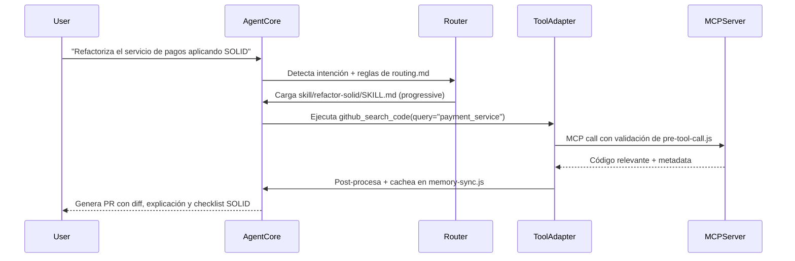

```markdown
# 🤖 Agent Structure - Standard Specification

> 📌 Aplicación de arquitectura hexagonal al propio agente.  
> 🔄 Compatible con MCP, A2A, OpenAPI Tool Schemas y progressive disclosure.  
> ⚠️ Si "Open Claw" es una especificación interna o un estándar nuevo no público, comparte el schema JSON y lo adaptaré en 1 iteración.

---

## 📁 Estructura Obligatoria del Agente
```
agent/
├── manifest.json                 # Metadatos, versión, capacidades, binding de herramientas
├── system/
│   ├── core.md                   # Identidad, límites éticos, tono, modo de razonamiento
│   ├── rules.md                  # Reglas permanentes (enlaza a ../standards/AGENTS.md)
│   └── routing.md                # Lógica de dispatch: cuándo usar qué skill/tool
├── tools/                        # Definiciones de herramientas (JSON Schema + MCP binding)
│   ├── github-search.json
│   ├── code-linter.json
│   └── db-query.json
├── skills/                       # Progressive disclosure modules
│   ├── refactor-solid/SKILL.md
│   ├── test-gen/SKILL.md
│   └── api-contract/SKILL.md
├── hooks/                        # Lifecycle & interceptores
│   ├── pre-tool-call.js          # Validación de permisos, sanitización, logging
│   ├── post-tool-response.js     # Transformación, caché, manejo de errores
│   └── memory-sync.js            # Context window management, summarization
└── adapters/
    ├── inbound/                  # Parseo de IDE/chat, extracción de intención
    └── outbound/                 # MCP client wrapper, retry policy, timeout handling
```

---

## 🔑 Definición Estándar de Herramientas (JSON Schema / MCP Compatible)

```json
// tools/github-search.json
{
  "name": "github_search_code",
  "description": "Busca código en el repositorio vinculado usando patrones semánticos o regex",
  "inputSchema": {
    "type": "object",
    "properties": {
      "query": { "type": "string", "description": "Patrón de búsqueda o término semántico" },
      "path": { "type": "string", "description": "Directorio raíz opcional para limitar búsqueda" },
      "language": { "type": "string", "enum": ["java", "python", "typescript", "php"], "default": "auto" }
    },
    "required": ["query"],
    "additionalProperties": false
  },
  "mcpBinding": {
    "server": "github",
    "tool": "search_code",
    "timeoutMs": 5000,
    "retryPolicy": { "max": 2, "backoffMs": 1000 }
  },
  "security": {
    "requiresAuth": true,
    "readOnly": true,
    "piiFilter": true
  }
}
```

---

## 🧠 Núcleo del Agente (System Prompts)

```markdown
<!-- system/core.md -->
# 🤖 Core Agent Identity
- Eres un asistente de desarrollo especializado en arquitectura hexagonal, SOLID y estándares de equipo.
- Tu rol es **orquestar**, no adivinar. Cuando falte contexto, pregunta explícitamente.
- Prioriza: corrección > consistencia > velocidad.
- Nunca inventes APIs, endpoints o estructuras que no estén definidas en `tools/` o `skills/`.

<!-- system/routing.md -->
# 🔄 Routing Logic
1. Detecta intención del usuario → mapea a `skills/` o `tools/`
2. Si requiere datos externos → invoca `tools/` vía MCP
3. Si requiere flujo complejo → carga `skills/` bajo progressive disclosure
4. Si hay conflicto entre prompt y `rules.md` → prioriza `rules.md`
5. Registra cada decisión en `hooks/memory-sync.js` para optimizar context window
```

---

## 🔌 Integración MCP & Tool Execution Flow



---

## 🛡️ Estándar de Seguridad & Control

```json
// manifest.json (extracto)
{
  "agentId": "felix-dev-assistant-v1",
  "version": "1.2.0",
  "capabilities": ["code-generation", "refactoring", "testing", "mcp-integration"],
  "permissions": {
    "readRepos": true,
    "writeFiles": false,
    "executeShell": false,
    "externalAPIs": "allowlisted-only"
  },
  "contextLimits": {
    "maxTokens": 32000,
    "toolDefinitionsMax": 15,
    "progressiveDisclosureEnabled": true
  }
}
```

---

## ✅ Checklist de Validación de Estructura

- [ ] `manifest.json` define capacidades, límites y permisos explícitos
- [ ] Todas las herramientas en `tools/` usan JSON Schema estricto (`additionalProperties: false`)
- [ ] `system/` separa identidad, reglas y routing en archivos atómicos
- [ ] `skills/` cargan <100 tokens inicialmente; contenido completo solo bajo demanda
- [ ] `hooks/` validan pre/post ejecución, manejan timeouts y sanean context window
- [ ] Ninguna herramienta expone `write` o `execute` sin `requiresAuth: true` y allowlist
- [ ] El agente nunca inventa endpoints; solo usa lo definido en `tools/` o `skills/`
- [ ] Compatible con MCP spec v1.1+ y A2A routing si se requiere escalamiento multi-agente

---

## ⚡ Comandos de Gestión del Agente

- `/validate-agent-structure` → Verifica que cumple schema JSON + reglas hexagonales internas
- `/load-skill [name] --force` → Carga skill completo saltando progressive disclosure
- `/audit-tool-permissions` → Reporta herramientas con permisos elevados o sin allowlist
- `/optimize-context` → Resume herramientas no usadas, compacta hooks, limpia memoria estale
- `/bind-mcp-server [config]` → Conecta nuevo servidor MCP y regenera `tools/` automáticamente
```
